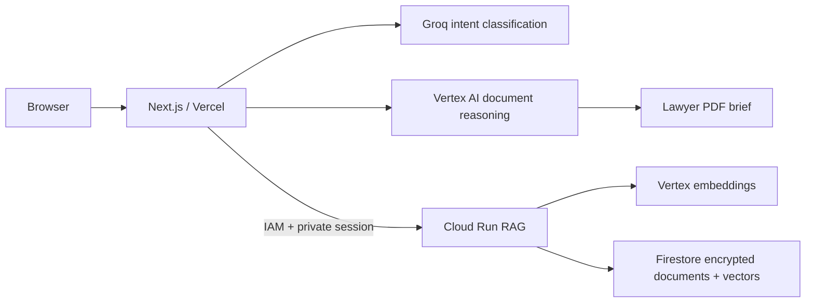

# Legal Document Navigator

Next.js MVP for **AI for Legal Assistance & Access**. A white, monochrome document workspace with variable Inter and stadium-pill buttons. `DESIGN-mobbin.md` was not present; the supplied visual requirements are implemented in `src/app/globals.css`.

## Run

```powershell
npm ci
npm run dev
```

Open http://localhost:3000. The built-in sample contract supports side-by-side reading, source-linked findings, reviewed checklists, prepared sample Q&A, and a real downloadable lawyer brief. It is explicitly labeled as illustrative and is never substituted for analysis of an uploaded document.

## Live Services

1. Create `.env.local` using `.env.example`. Add the Groq key and Google Cloud project.
2. Deploy the private [Cloud Run RAG service](services/rag/README.md), including Firestore rules, expiry policies, encryption key, and IAM permissions. Set `CLOUD_RUN_RAG_URL` and `SESSION_SECRET` in Next.js.
3. Provide the Next.js runtime with service-account credentials that can call Vertex AI and invoke the Cloud Run service. For local service-account impersonation, follow the RAG service instructions. Ordinary user ADC cannot mint the required Cloud Run identity token.
4. Install/update the Vercel CLI with `npm i -g vercel`. Use `vercel env add`, `vercel env pull`, and `vercel deploy --prod` to configure and release. Never paste keys into source or chat.

The UI reports missing connections, and live endpoints return 503 until configured. No credentials are embedded. Configuration presence is not a live connectivity test.

## Architecture

| Component | Implementation |
| --- | --- |
| Frontend and delivery | Next.js App Router on Vercel. Static assets use the CDN. Document APIs use the Node.js runtime and `private, no-store`; sensitive responses are never edge-cached. |
| Routing | Groq classifies summaries, clauses, obligations, dates, advice, and unrelated questions before Vertex execution. Model is configurable. |
| Document reasoning | Vertex AI Gemini performs complete plain-English translation, source-linked risk/date/obligation extraction, Q&A, and lawyer-brief synthesis. Gemini 1.5 Pro is retired; the default is `gemini-2.5-pro`, configurable through `VERTEX_MODEL`. |
| Sessions and RAG | Signed HttpOnly session cookie; private Cloud Run service; Firebase Firestore; Vertex embeddings; AES-256-GCM encryption of source text, chat, and vectors; per-session authorization and authenticated service calls. |
| Lawyer prep | Server-side PDF generation with embedded fonts, source excerpts, questions from chat, targeted professional questions, and the immutable legal disclaimer on every page. |



## Boundaries

- Legal information, not professional advice. The non-dismissible UI notice and every AI system prompt make this explicit. The product helps users prepare information and questions for a qualified professional.
- PDF/TXT uploads: 4 MB file, 100 pages, 160 KB extracted UTF-8 text, 128 retrieval chunks. Searchable PDFs only; scanned, empty, malformed, and unsupported documents produce clear errors. No OCR is claimed.
- Citations must match source excerpts. The translation validator rejects omitted source text; a failed validation returns an error rather than an incomplete review. Quotes alone cannot prove that a model's explanation is correct, so human verification remains necessary.
- Sessions expire after 24 hours. Document access is bound to the browser session, not an account. Google Cloud TTL policies must be enabled as documented. Provider retention is governed by the configured service accounts and contracts.
- PDF fonts support Latin, Greek, and Cyrillic. Unsupported scripts return an explicit error rather than corrupting legal text.
- Routing reduces classification latency; heavy reasoning still takes time. No guaranteed response-time or exhaustive legal-review claim is made.

## Verify

```powershell
npm run typecheck
npm run lint
npm test
npm --prefix services/rag test
npm run build
```

With the local server running, `npm run test:ui` checks desktop and mobile review, citations, sample Q&A, PDF downloads, and upload validation using installed Chrome. Screenshots are saved under `artifacts/`.

Regenerate the sample PDF and its actual first-page preview with `npx tsx scripts/generate-sample.ts`. Live Groq, Vertex AI, Firestore, and Cloud Run checks require configured credentials and a deployed service.

Provider references: [Groq provider](https://ai-sdk.dev/providers/ai-sdk-providers/groq), [Vertex provider](https://ai-sdk.dev/providers/ai-sdk-providers/google-vertex), [Google model lifecycle](https://docs.cloud.google.com/gemini-enterprise-agent-platform/models/model-versions).
