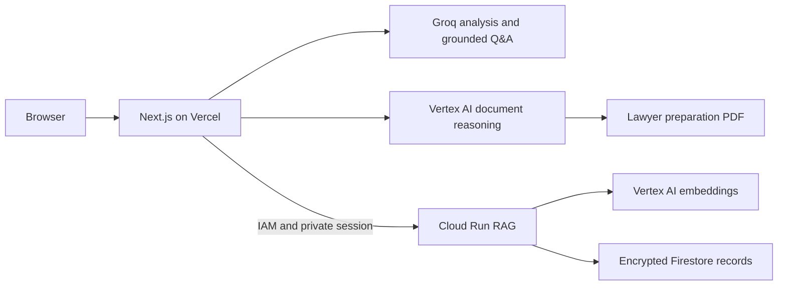

# Legal Document Navigator

Legal Document Navigator is a Next.js application for the **AI for Legal Assistance & Access** problem statement. It helps people understand a contract, verify explanations against the original wording, ask document-grounded questions, and prepare a concise brief for a qualified legal professional.

It provides legal information, not legal advice. The boundary is shown throughout the interface and included in every generated lawyer brief.

## Core workflow

1. Upload a searchable PDF or plain-text contract.
2. Read a complete, source-linked plain-English explanation of every clause.
3. Review extracted obligations, important dates, and terms that may deserve professional attention.
4. Ask questions and follow every answer back to exact document evidence.
5. Mark findings as reviewed and download a lawyer-preparation PDF containing the relevant terms, conversation concerns, and questions to discuss.

The built-in sample contract demonstrates the entire workflow without pretending that a user document was analyzed. Uploaded documents remain bound to the browser's private session.

## Generative AI services

| Service | Use in the application |
| --- | --- |
| Groq (`openai/gpt-oss-20b` by default) | Provides document analysis, plain-English clauses, grounded Q&A, answer-boundary classification, and prep generation in local or browser-session mode. |
| Vertex AI Gemini (`gemini-2.5-pro` by default) | Produces complete clause translations, document summaries, source-linked findings, grounded answers, and lawyer-preparation content in the production architecture. |
| Vertex AI embeddings (`gemini-embedding-001`) | Embeds encrypted document chunks and questions in the private Cloud Run RAG service for semantic retrieval. |

All model names are configurable through environment variables. Model output is validated against the source: clauses must cover the complete document, findings must quote their linked clauses, and answers must cite exact supporting text.

## Run locally

```powershell
npm ci
npm run dev
```

Open http://localhost:3000.

Create `.env.local` from `.env.example`. For local experiments without Vertex AI, Cloud Run, or Firebase billing, set `LOCAL_FREE_MODE=true` and provide a Groq key. Local mode uses in-memory session storage, resets when the server restarts, and is automatically disabled in production.

For a hosted demonstration without persistent document storage, set `BROWSER_SESSION_MODE=true` and provide a Groq key. Uploaded document state remains in the active browser tab, is validated again at each API boundary, and disappears on refresh. Use the private Cloud Run architecture below when persistence is required.

## Production services

1. Deploy the private [Cloud Run RAG service](services/rag/README.md), including its Firestore rules, expiry policies, encryption key, and IAM permissions.
2. Set `CLOUD_RUN_RAG_URL` and a random `SESSION_SECRET` of at least 32 characters.
3. Configure a Google service identity that can invoke the private Cloud Run service and call Vertex AI. Browser clients never receive Google credentials or direct Firestore access.
4. Configure the Groq and Vertex model variables shown in `.env.example`.

The application reports missing connections and returns an honest 503 response when production services are unavailable. No credentials are embedded in source code.

## Architecture

| Component | Implementation |
| --- | --- |
| Frontend and delivery | Next.js App Router on Vercel. Document APIs use the Node.js runtime and send private, non-cacheable responses. |
| Grounded Q&A | One structured model call classifies the answer boundary and answers from source clauses selected by retrieval, avoiding a redundant classifier request. |
| Document reasoning | Vertex AI Gemini performs complete plain-English translation, source-linked extraction, Q&A, and lawyer-brief synthesis. |
| Sessions and RAG | Signed HttpOnly cookie, private Cloud Run service, Firestore, Vertex embeddings, AES-256-GCM encryption, per-session authorization, and authenticated service calls. |
| Lawyer preparation | Server-side PDF generation with source excerpts, reviewed findings, conversation concerns, professional questions, embedded fonts, and a legal-information disclaimer on every page. |



## Safety and product boundaries

- The application explains document wording and helps prepare questions; it does not recommend whether to sign or make legal decisions.
- Uploads are limited to searchable PDF and TXT files: 4 MB, 100 pages, 160 KB of extracted UTF-8 text, and 128 retrieval chunks. Empty, malformed, disguised, scanned, and unsupported documents return clear errors. OCR is not claimed.
- Citation validation rejects invented clauses, unsupported findings, incomplete source coverage, and answers without exact evidence.
- Sessions expire after 24 hours. Access is tied to the private browser session rather than an account, and deletion removes the document and its embedding chunks.
- Generated PDF fonts support Latin, Greek, and Cyrillic. Unsupported scripts return an explicit error instead of producing corrupt legal text.

## Verification

```powershell
npm run typecheck
npm run lint
npm test
npm --prefix services/rag test
npm run build
```

With the local server running, `npm run test:ui` verifies the complete sample workflow on desktop and mobile, including source navigation, grounded Q&A, reviewed findings, PDF download, upload boundaries, keyboard focus, dialog focus restoration, and automated WCAG 2.0–2.2 A/AA checks with axe-core.

The GitHub Actions workflow runs installation, type checking, linting, both backend suites, a production build, and the browser suite for every pull request and push to `main`.

Live Groq, Vertex AI, Firestore, Cloud Run IAM, and retention checks require configured project credentials and a deployed service.
